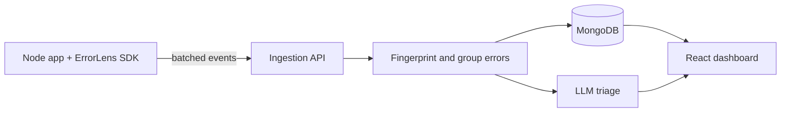

  

  

---

## 👋 About Me

B.Tech Computer Science graduate (2026) from NIET, Greater Noida. I build full-stack web applications with the **MERN stack** and solve data structures and algorithms problems in **Java** (100+ LeetCode problems so far).

I built and deployed the **Job Application Tracker** (below) end to end, and I'm now working on **ErrorLens**, a bigger project to deepen my backend skills: APIs, testing, Docker and LLM integration.

I'm looking for a **Software Engineer / Associate Software Engineer / Full-Stack Developer** role where I can ship features, learn from code reviews and grow quickly.

---

## 🛠️ Tech Stack

**Languages**
 

**Frontend**
 

**Backend & Database**
 

**Tools**
 

**Core concepts:** Data Structures & Algorithms · Object-Oriented Programming · REST APIs · JWT Authentication · DBMS

---

## 🚀 Projects

### 📋 Job Application Tracker
A full-stack app to track job applications by company, role, status and follow-up date, with each user's data kept private.

- 🔐 JWT authentication and protected routes (users only see their own data)
- ✅ Input validation and error handling on the REST API endpoints
- 🔄 Create, update, filter, sort and delete applications
- 📊 Status views: Applied, Interview, Offer, Rejected
- 📱 Responsive dashboard
- ☁️ Deployed live with MongoDB Atlas

**Tech:** `React` `Node.js` `Express.js` `MongoDB` `Mongoose` `JWT`

🔗 [**Live Demo**](https://job-application-tracker-one-zeta.vercel.app/) (first load may take a moment if the server is asleep) · 💻 [**Source Code**](https://github.com/hariskhan1613/job-application-tracker)

---

### 🔍 ErrorLens: AI-Assisted Error Monitoring for Node.js Apps

A mini error-monitoring tool: a small SDK captures errors from a Node.js app, an API groups duplicate errors into issues, and an LLM suggests a likely cause and fix. I'm building it from scratch to learn backend engineering properly, and I plan to run it on my own Job Application Tracker.

**Planned architecture**

**What I'm building**
- [ ] Ingestion API with API-key auth and request validation
- [ ] Error fingerprinting and grouping
- [ ] npm SDK with batching and retry
- [ ] React dashboard with issue list and charts
- [ ] LLM-based triage with caching and validation
- [ ] Tests, Docker and CI

**Planned stack:** `Node.js` `Express.js` `TypeScript` `MongoDB` `React` `Jest`

💻 Source code: coming soon (will be linked here once the first milestone is pushed)

---

## 📚 Currently Learning

| Area | Focus |
|---|---|
| ⚙️ Backend | TypeScript, API design, validation, authentication |
| 🧪 Quality | Testing with Jest and Supertest |
| 🐳 DevOps | Docker, GitHub Actions |
| 🗄️ Databases | MongoDB indexing and aggregation |
| 🤖 AI | Integrating LLM APIs into applications |
| 🧠 Problem solving | Data structures and algorithms in Java |

---

## 📊 GitHub Analytics

 

---

## 🏅 Certifications

- Object-Oriented Programming in Java (Coursera)
- Java Programming: Arrays, Lists, and Structured Data (Coursera)
- Database Management Systems (Infosys Springboard)
- Python for Data Science, AI & Development (IBM / Coursera)

---

## 🎓 Education

**B.Tech in Computer Science and Engineering**
Noida Institute of Engineering and Technology (NIET), Greater Noida · 2022 – 2026

---

## 📫 Let's Connect

 

> *Build with purpose. Solve with logic. Keep learning.*

